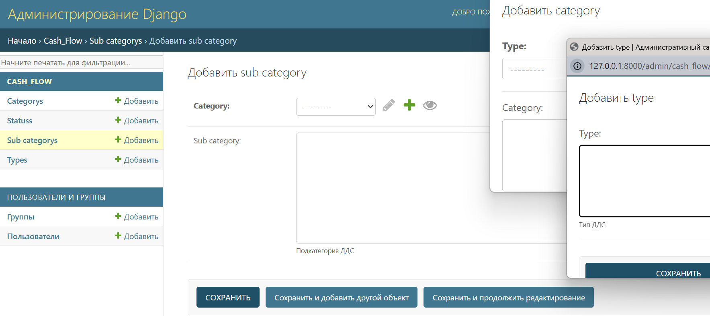
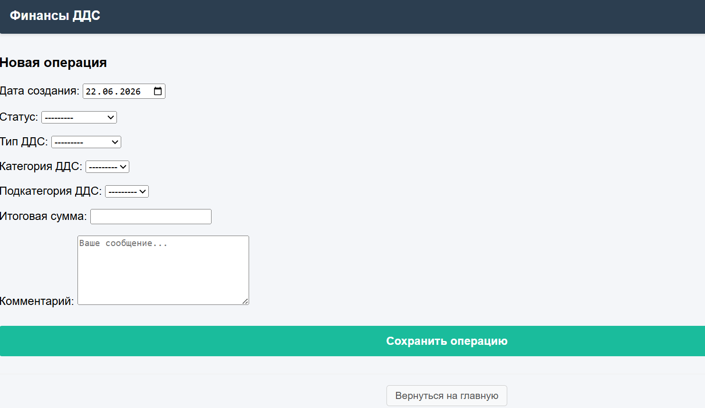
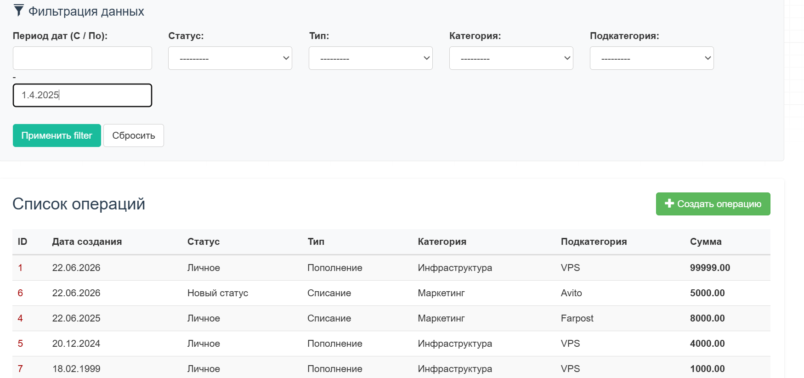
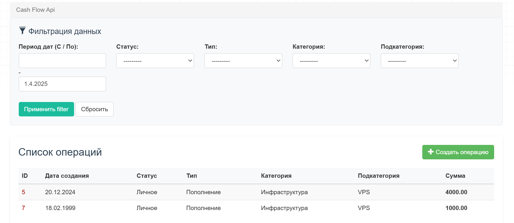
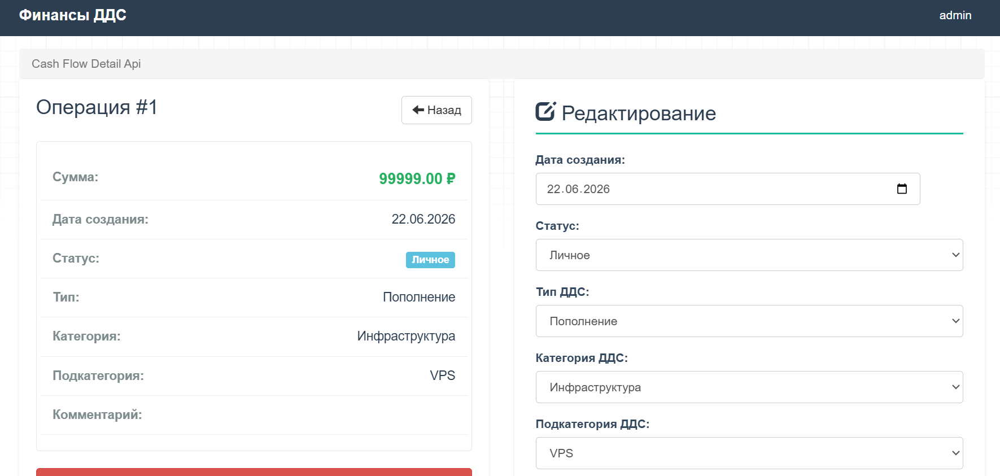
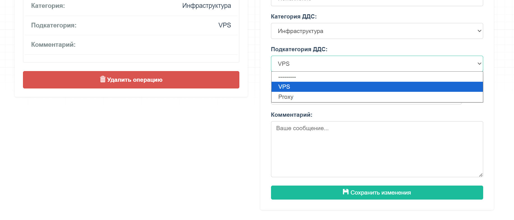

# 🚀 Django Marketplace (Test Application)

Тестовое веб-приложение: Веб-сервис для управления движением денежных средств (ДДС)

## Ключевые возможности

*   **Управление записями ДДС (CRUD):** Создание, просмотр, редактирование и удаление записей.
*   **Управление справочниками через админ-панель:** Добавление, редактирование и удаление статусов, типов, категорий и подкатегорий.
*   **Логические зависимости:** Подкатегории привязаны к категориям. Категории привязаны к типам.  
*   **Интерфейс:** Приложению доступно несколько ссылок для управления/просмотра: "/admin/", "/cash/general/", "/cash/detail_flow/<int>/"
*   **Контейнеризация:** Приложение обернуто в docker-контейнер

## 🛠 Стек технологий

*   **Backend:** Python 3, Django, Django ORM
*   **Frontend:** HTML5, CSS3, JavaScript (Vanillajs)
*   **Database:** SQLite
*   **DevOps:** Docker, Docker Compose

---

## 💻 Быстрый запуск

Для запуска проекта вам понадобится установленный [Docker](https://docker.com) и [Docker Compose](https://docker.com).

### 1. Клонирование репозитория
```bash
git clone https://github.com
cd shopapp
```

### 2. Запуск контейнеров
Сборка образов и запуск всех сервисов приложения в фоновом режиме:
```bash
docker compose up --build -d
```

---

## Создание суперпользователя и инициализация БД
Для создания суперпользователя выполните команду:
```bash
python manage.py migrate
python manage.py createsuperuser
```

---

## 📁 Структура проекта (основные модули)

*   `cash_flow/` — Управление записями и справочниками.

---

## Примеры работы приложения:






